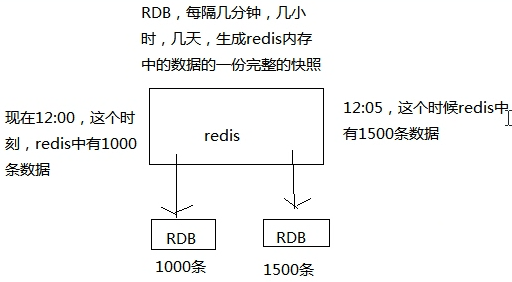
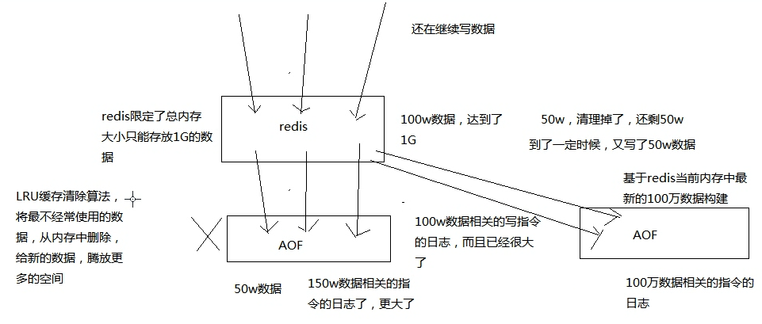

redis persistence:
redis 持久化的两种机制：RDB，AOF
RDB

AOF

AOF Mechanism: 为了保证性能，会先写入 os cache 中，然后定期强制执行 fsync 操作将数据刷入磁盘
因为每台单机 redis 的数据量是受内存限制的，所以 aof 文件不会无限增长
且当数据超过内存限制的时候，会自动使用 LRU 算法将一部分数据淘汰掉
AOF 存放的是每条写入命令，所以会不断膨胀，当达到一定时候，会做 rewrite 操作
rewrite 操作：基于当时 redis 内存中的数据，重新构造一个更小的 aof 文件，然后删除旧的 aof 文件

总结一下： aof 不断被追加，内存中数据有最大限制会自动淘汰，当 aof 中的数据大于内存中数据时，就会执行 rewrite 操作，生成新的 aof 文件

AOF 机制对每条写入命令作为日志，以 append-only 的模式写入一个日志文件中，在 redis 重启的时候，可以通过回放 AOF 日志中的写入指令来重新构建整个数据集

RDB 持久化机制的优点:
适合做冷备
性能影响小
数据恢复快
RDB 持久化机制的缺点:
在故障时，数据丢得多
一般来说，RDB 数据快照文件，都是每隔 5 分钟，或者更长时间生成一次，一旦 redis 进程宕机，那么会丢失最近 5 分钟的数据（因为在内存中还未来得及导出到磁盘）
这个问题也是 rdb 最大的缺点，就是不适合做第一优先的恢复方案，如果你依赖 RDB 做第一优先恢复方案，会导致数据丢失的比较多
AOF 持久化机制的优点
在故障时，数据丢得少
    一般 AOF 会每隔 1 秒，通过一个后台线程执行一次 fsync 操作，保证 os cache 中的数据写入磁盘中，最多丢失 1 秒钟的数据
AOF 文件写入性能高
    AOF 日志文件以 append-only 模式写入，所以没有任何磁盘寻址的开销，写入性能非常高，而且文件不容易破损，即使文件尾部破损，也很容易修复(官方提供了一个修复工具)
rewrite 操作对 redis 主线程影响较小
    AOF 日志文件即使过大的时候，出现后台重写操作，也不会影响客户端的读写。因为在 rewrite log 的时候，会对其中的数据进行压缩，创建出一份需要恢复数据的最小日志出来。再创建新日志文件的时候，老的日志文件还是照常写入。当新的 merge 后的日志文件 ready 的时候，再交换新老日志文件即可。
AOF 文件内容比较容易阅读
    这个特性非常适合做灾难性的误删除的紧急恢复。比如某人不小心用 flushall 命令清空了所有数据，只要这个时候后台 rewrite 还没有发生，那么就可以立即拷贝 AOF 文件，将最后一条 flushall 命令给删了，然后再将该 AOF 文件放回去，就可以通过恢复机制，自动恢复所有数据

AOF 持久化机制的缺点:
日志文件稍大
性能稍低
发生过 BUG
数据恢复较慢

RDB 和 AOF 到底该如何选择
不要仅仅使用 RDB，因为那样会导致你丢失很多数据

也不要仅仅使用 AOF，因为那样有两个问题

第一，你通过 AOF 做冷备，没有 RDB 做冷备，来的恢复速度更快;

第二，RDB 每次简单粗暴生成数据快照，更加健壮，可以避免 AOF 这种复杂的备份和恢复机制的 bug

综合使用 AOF 和 RDB 两种持久化机制

用 AOF 来保证数据不丢失，作为数据恢复的第一选择;

用 RDB 来做不同程度的冷备，在 AOF 文件都丢失或损坏不可用的时候，还可以使用 RDB 来进行快速的数据恢复

结论就是：都用，AOF 作为第一恢复方式，RDB 后补