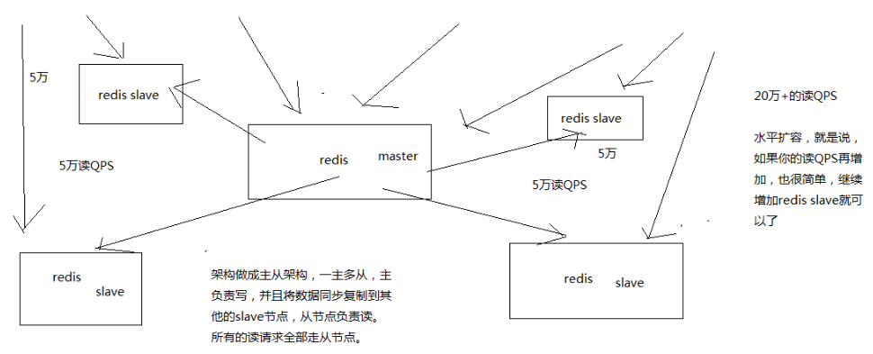
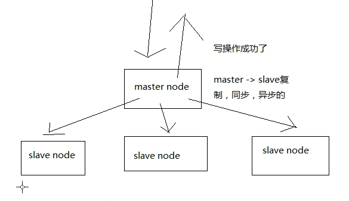

单机 redis 一般情况下能够承载的 QPS 上万到几万不等，根据你的业务操作的复杂性， redis 提供很多复杂的操作，如 lua 脚本等复杂的操作，那么可能会更低。 比如就简单的 kv 查询来说还是比较容易达到上万的。

假设有上千万、上亿的用户来访问，直接就能把你的单机 redis 干死

单机在一般就几万。要提高并发，一般的方案是 读写分离，一般来说，对缓存，一般都是用来支撑读高并发的，写的请求是比较少的，可能写请求也就一秒钟几千，一两千，大量的请求都是读，一秒钟二十万次读

一主多从，主负责写，并且将数据同步复制到其他 slave 节点，从节点负责读，还可水平扩展 slave 节点以支撑更多的 QPS

主从架构 -> 读写分离 -> 支撑 10万+ 读 QPS 的架构

redis replication 基本原理

master 持久化开启
冷备方案一定要做（之前讲解的定时备份的方案）

Same PC Architecture (❌ Not Recommended):
┌─────────────────────────────────┐
│         Single Machine           │
│  ┌─────────────┐ ┌─────────────┐│
│  │ Master Redis│ │ Slave Redis ││
│  │   (6379)    │ │   (6380)    ││
│  └─────────────┘ └─────────────┘│
│  CPU, Memory, Network, I/O Shared │
└─────────────────────────────────┘

Production Architecture:
┌─────────────┐    ┌─────────────┐    ┌─────────────┐
│ Master Node │    │ Slave Node 1│    │ Slave Node 2│
│             │    │             │    │             │
│ Redis Master│◄──►│ Redis Slave │◄──►│ Redis Slave │
│ Port: 6379  │    │ Port: 6379  │    │ Port: 6379  │
│             │    │             │    │             │
│ Handles     │    │ Handles     │    │ Handles     │
│ Writes Only │    │ Reads Only  │    │ Reads Only  │
└─────────────┘    └─────────────┘    └─────────────┘
       │                   │                   │
       └───────────────────┼───────────────────┘
                           │
                    ┌─────────────┐
                    │   Client    │
                    │ Applications│

Redis 主从架构 和 Redis Replication 实际上是同一概念的不同表述，但在技术语境中有细微差别。

📖 概念关系
Redis Replication (技术机制)
Redis Replication 是技术实现机制，指数据从一个 Redis 实例复制到另一个实例的过程。

主从架构 (架构模式)
主从架构是部署架构模式，使用 Replication 技术实现读写分离的架构设计。

🔍 技术对比分析
方面	Redis Replication	主从架构
定义	数据复制的技术机制	基于复制的部署架构
关注点	数据同步、一致性、故障恢复	系统设计、性能、扩展性
范围	技术层面	架构层面
应用	任何需要数据复制的场景	读写分离、高并发场景
🛠️ Redis Replication 技术机制
核心组件
Master Instance
├── Replication ID
├── Offset
├── Backlog Buffer
└── Background Save Thread

Slave Instance  
├── Initial Sync (RDB + Commands)
├── Continuous Sync (Command Stream)
└── Partial Resync (Backlog)
工作流程
连接建立: Slave 连接 Master
全量同步: Master 发送 RDB 快照
增量同步: 实时复制写命令
断线重连: 支持部分重同步
🏗️ 主从架构模式
1. 基础主从架构
Write Requests → Master → Slaves
                      ↓
                 Read Requests
2. 级联主从架构
Master
   ↓
Slave-Master
   ↓
Slave Slaves
3. 哨兵架构
┌─────────────┐
│   Sentinel  │ ── Monitor & Auto Failover
└─────────────┘
       ↓
┌─────────────┐    ┌─────────────┐
│   Master    │◄──►│   Slave     │
└─────────────┘    └─────────────┘
📊 配置对比
Replication 配置 (Master)
bash
插入
复制
新建文件
保存
运行
应用代码
# 启用复制相关的核心配置
replica-announce-ip 192.168.1.10
replica-announce-port 6379
min-replicas-to-write 1      # 至少1个从节点确认写操作
min-replicas-max-lag 10      # 最大延迟10秒
主从架构配置 (Slave)
bash
插入
复制
新建文件
保存
运行
应用代码
# 从节点连接主节点
replicaof 192.168.1.10 6379
masterauth yourpassword
replica-read-only yes