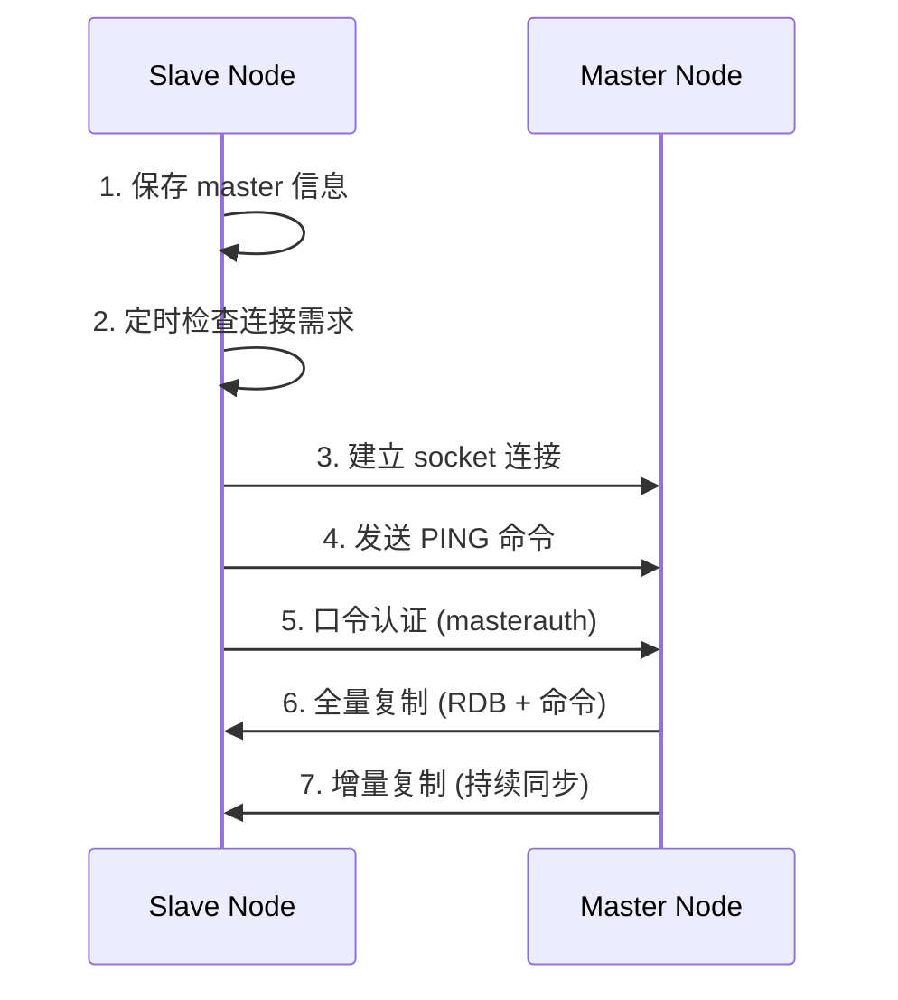
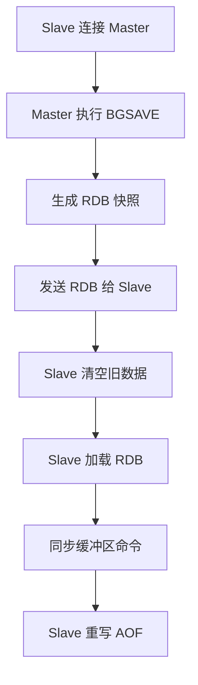
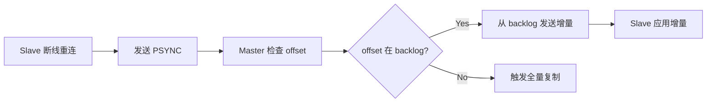
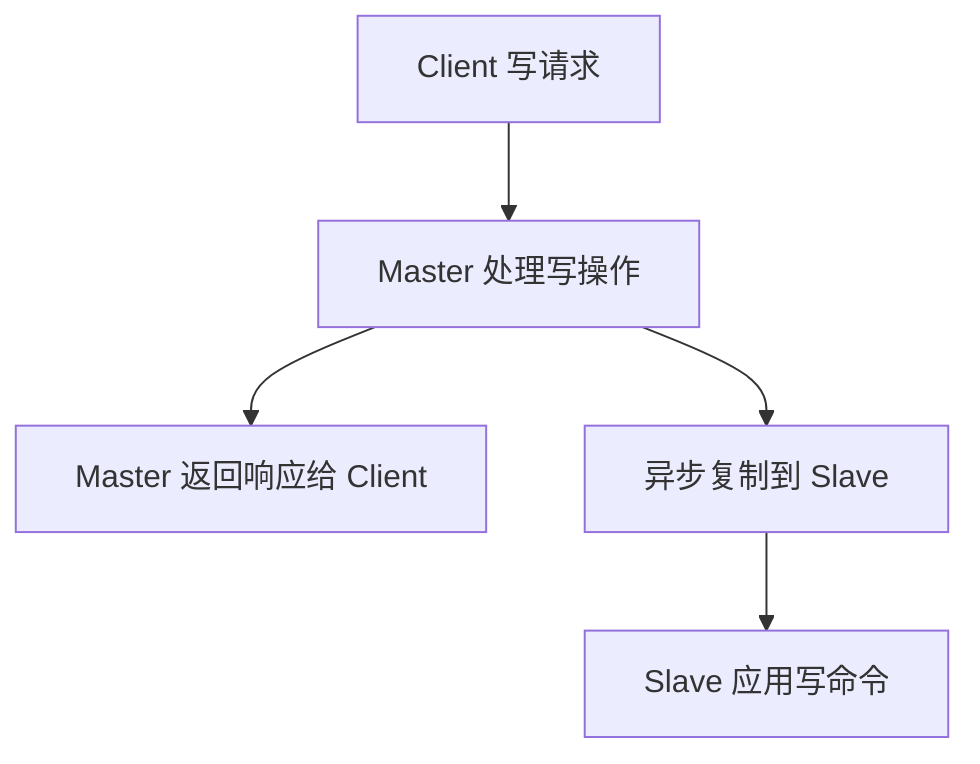

# 🔄 Redis Replication 完整流程与深度原理剖析

## 📋 目录
- [完整复制流程](#-完整复制流程)
- [核心机制详解](#-核心机制详解)
- [全量复制过程](#-全量复制过程)
- [增量复制机制](#-增量复制机制)
- [心跳检测](#-心跳检测)
- [异步复制](#-异步复制)

---

## 🔄 完整复制流程



### 🔧 阶段详解

| 阶段 | 操作 | 说明 |
|------|------|------|
| **1. 初始化** | 保存 master 信息 | 从 `redis.conf` 的 `slaveof` 配置获取 |
| **2. 连接建立** | 定时检查 & 建立连接 | 每秒检查，建立 socket 连接 |
| **3. 身份验证** | PING + 认证 | 确保通信正常和权限验证 |
| **4. 数据同步** | 全量 + 增量复制 | 先全量同步，后增量同步 |

---

## 🧠 核心机制详解

### 1. 📊 Offset 机制

Master 和 Slave 都维护各自的 offset：

```bash
# Master 端
master_repl_offset: 1234567890

# Slave 端  
slave_repl_offset: 1234567890
```

**工作原理：**
- **Master**: 每个写命令都递增 offset
- **Slave**: 每秒上报自己的 offset 给 Master
- **Master**: 保存每个 Slave 的 offset

**作用：** 监控主从数据一致性，判断是否需要增量复制

### 2. 📝 Backlog 缓冲区

```bash
# 配置参数
repl-backlog-size 1MB    # 默认 1MB
repl-backlog-ttl 3600    # 保留时间
```

**功能特性：**
- **双向记录**: Master 向 Slave 复制时，同时在 backlog 中备份
- **增量恢复**: 全量复制中断时，用于增量恢复
- **环形缓冲**: FIFO 机制，自动覆盖旧数据

### 3. 🆔 Master Run ID

```bash
# 查看 Master Run ID
redis-cli > info server
run_id: 9b3e4cb502e78b0b5664f66eeac6eceb36bc8e28
```

**Run ID 的作用：**

| 场景 | 说明 |
|------|------|
| **Master 重启** | Run ID 变化，触发全量复制 |
| **数据恢复** | 通过 Run ID 区分不同的 Master 实例 |
| **故障判断** | Run ID 不匹配 = 需要全量同步 |

**特殊命令：**
```bash
# 重启不改变 Run ID
redis-cli debug reload
```

### 4. 📡 PSYNC 命令

```bash
# Slave 端执行
PSYNC <run_id> <offset>
```

**Master 响应类型：**

| 响应类型 | 格式 | 触发条件 |
|---------|------|----------|
| **FULLRESYNC** | `+FULLRESYNC <run_id> <offset>` | Run ID 不匹配或 offset 超出 backlog |
| **CONTINUE** | `+CONTINUE` | 在 backlog 范围内，可增量复制 |

---

## 📦 全量复制过程

### 🔄 详细流程图



### ⚙️ 关键配置参数

```bash
# 复制超时设置
repl-timeout 60

# 客户端输出缓冲区限制
client-output-buffer-limit slave 256MB 64MB 60
```

### 📊 性能分析

| 操作 | 耗时估算 | 说明 |
|------|---------|------|
| **RDB 生成** | 10-30s | 取决于数据量 |
| **网络传输** | 30-60s | 千兆网卡约 100MB/s |
| **Slave 加载** | 10-20s | 内存加载速度 |
| **AOF 重写** | 20-30s | 如果开启 AOF |

**总耗时：** 4-6GB 数据约需 **1.5-2 分钟**

### 🚨 失败场景

1. **网络超时**：
   ```bash
   # 超过 repl-timeout 60s
   # 解决：适当调大 repl-timeout
   repl-timeout 180
   ```

2. **缓冲区溢出**：
   ```bash
   # 超过 64MB 持续缓冲或 256MB 一次性
   # 解决：调整缓冲区限制
   client-output-buffer-limit slave 512MB 128MB 120
   ```

---

## ⚡ 增量复制机制

### 🔧 工作原理



### 📋 触发条件

| 条件 | 增量复制 | 全量复制 |
|------|---------|----------|
| **Run ID 匹配** | ✅ | ❌ |
| **Offset 在 backlog** | ✅ | ❌ |
| **Backlog 大小足够** | ✅ | ❌ |

### 🔍 实际案例

```bash
# 正常增量复制
> PSYNC 9b3e4cb502e78b0b5664f66eeac6eceb36bc8e28 123456
+CONTINUE

# 触发全量复制  
> PSYNC invalid_run_id 999999
+FULLRESYNC 9b3e4cb502e78b0b5664f66eeac6eceb36bc8e28 0
```

---

## 💓 心跳检测机制

### 📊 心跳配置

| 节点类型 | 默认间隔 | 作用 |
|---------|---------|------|
| **Master → Slave** | 10 秒 | 检测 Slave 存活 |
| **Slave → Master** | 1 秒 | 上报状态和 offset |

### 🔍 心跳内容

**Slave → Master：**
```bash
REPLCONF ACK <offset>
```

**Master → Slave：**
```bash
PING  # 简单的连接检测
```

### 📈 监控指标

```bash
# 查看复制延迟
redis-cli > info replication
# 输出中的 slave0 字段
slave0:ip=192.168.1.11,port=6379,state=online,offset=123456789,lag=0
```

---

## 🔄 异步复制机制

### ⚡ 工作流程



### 📊 性能优势

| 特性 | 同步复制 | 异步复制 |
|------|---------|----------|
| **响应延迟** | 高 | 低 |
| **数据一致性** | 强一致 | 最终一致 |
| **吞吐量** | 低 | 高 |
| **可用性** | 低 | 高 |

### ⚠️ 风险与权衡

**异步复制的风险：**
- Master 故障时可能丢失少量数据
- 网络分区时数据不一致

**缓解策略：**
```bash
# 要求至少 N 个 Slave 确认写操作
min-replicas-to-write 1
min-replicas-max-lag 10
```

---

## 🎯 最佳实践总结

### ✅ 配置优化

```bash
# Master 配置
repl-backlog-size 100mb          # 增大 backlog
repl-timeout 180                  # 增加超时时间
min-replicas-to-write 1           # 保证至少 1 个副本
min-replicas-max-lag 10           # 最大延迟限制

# Slave 配置
repl-timeout 180
replica-serve-stale-data yes     # 断线时是否提供过期数据
```

### 📊 监控指标

| 指标 | 命令 | 正常值 |
|------|------|--------|
| **复制延迟** | `info replication` | < 1s |
| **连接状态** | `info replication` | online |
| **缓冲区使用** | `info clients` | < 80% |
| **网络带宽** | 系统监控 | < 80% |

### 🚨 故障处理

1. **复制中断**：
   ```bash
   # 检查网络和配置
   redis-cli > REPLCONF listening-port 6379
   ```

2. **大延迟**：
   ```bash
   # 检查 backlog 大小
   CONFIG GET repl-backlog-size
   ```

3. **频繁全量复制**：
   ```bash
   # 检查 Run ID 变化
   redis-cli > info server | grep run_id
   ```

---

## 💡 核心要点回顾

1. **完整性**: 复制流程确保数据从 Master 可靠传输到 Slave
2. **高效性**: 通过增量复制和异步机制提升性能  
3. **可靠性**: 多重保障机制确保数据不丢失
4. **扩展性**: 支持一主多从的读写分离架构

Redis Replication 是实现高可用、高性能 Redis 集群的**核心技术基础**，理解其完整流程和原理对于构建稳定可靠的缓存系统至关重要。