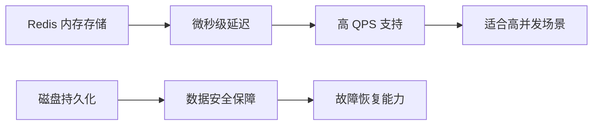
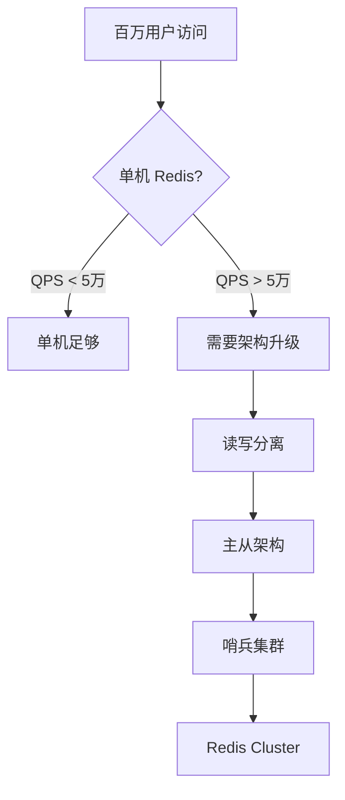
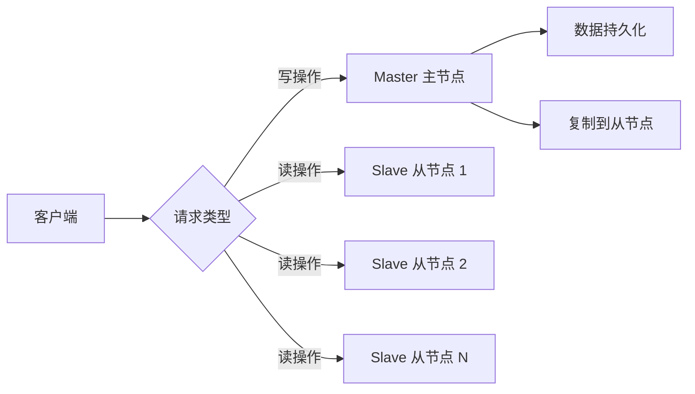
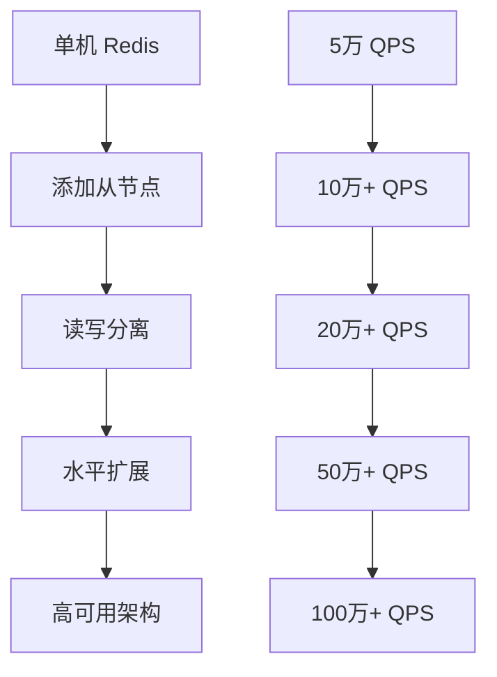
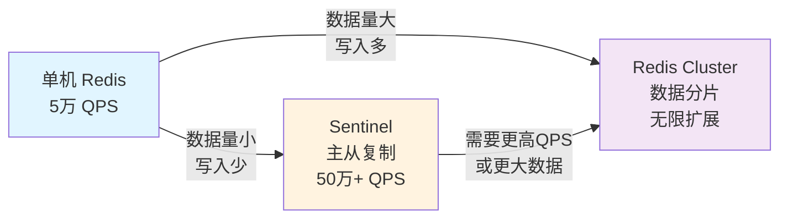

# 📊 Redis 数据库性能指标详解

## 📋 目录
- [性能基础对比](#-性能基础对比)
- [单机 Redis 性能分析](#-单机-redis-性能分析)
- [高并发架构演进](#-高并发架构演进)
- [主从架构性能提升](#-主从架构性能提升)

---

## ⚡ 性能基础对比

### 📈 数据库性能特征

| 数据库类型 | 存储介质 | QPS 范围 | 延迟特性 | 适用场景 |
|-----------|---------|---------|---------|---------|
| **MySQL** | 磁盘存储 | 1~2K | 毫秒级 | 持久化数据存储 |
| **Redis** | 内存存储 | 1万+ | 微秒级 | 高速缓存、会话存储 |

### 🎯 Redis 性能优势



---

## 🖥️ 单机 Redis 性能分析

### 📊 性能范围

| 业务复杂度 | QPS 范围 | 操作类型 | 说明 |
|-----------|---------|---------|------|
| **简单 KV 查询** | 5万+ | GET/SET | 最基础的读写操作 |
| **中等复杂操作** | 2-5万 | HSET/LPUSH | 包含数据结构操作 |
| **复杂操作** | 1-2万 | LUA脚本 | 包含计算和逻辑处理 |

### 🔍 性能影响因素

| 因素 | 影响 | 优化建议 |
|------|------|---------|
| **数据结构复杂度** | 🟡 中等 | 选择合适的数据结构 |
| **网络延迟** | 🟡 中等 | 优化网络配置 |
| **内存使用率** | 🔴 高 | 监控内存，避免换页 |
| **CPU 使用率** | 🟡 中等 | 避免复杂计算 |
| **持久化策略** | 🟡 中等 | 优化 RDB/AOF 配置 |

### ⚠️ 单机限制

```bash
# 典型瓶颈场景
用户规模: 1000万+ 
并发请求: 10万+
单机 Redis: 🚨 服务崩溃

# 崩溃原因
- CPU 达到 100%
- 内存不足
- 网络带宽耗尽
- 连接数超限
```

---

## 🚀 高并发架构演进

### 📊 并发需求分析



### 📈 缓存读写特征

| 请求类型 | 典型比例 | QPS 需求 | 处理策略 |
|---------|---------|---------|---------|
| **读请求** | 90%+ | 10万-50万 | 从节点处理 |
| **写请求** | 5-10% | 1千-5千 | 主节点处理 |
| **其他操作** | <5% | 少量 | 特殊节点处理 |

### 🎯 读写分离原理



---

## 🏗️ 主从架构性能提升

### 📊 架构演进路径



### 💡 扩展策略

#### 基础配置
```bash
# 1主2从架构
Master (写): 1-5万 QPS
Slave 1 (读): 5万+ QPS
Slave 2 (读): 5万+ QPS
总承载: 10万+ QPS
```

#### 水平扩展
```bash
# 扩展到 1主5从
Master (写): 1-5万 QPS
Slaves (读): 5 × 5万 = 25万 QPS
总承载: 30万+ QPS

# 扩展到 1主10从
Master (写): 1-5万 QPS  
Slaves (读): 10 × 5万 = 50万 QPS
总承载: 55万+ QPS
```

### 📋 性能对比表

| 架构类型 | 写 QPS | 读 QPS | 总 QPS | 节点数 | 复杂度 |
|---------|--------|--------|--------|--------|--------|
| **单机** | 1-5万 | 1-5万 | 5万 | 1 | 🟢 低 |
| **1主2从** | 1-5万 | 10万 | 15万 | 3 | 🟡 中 |
| **1主5从** | 1-5万 | 25万 | 30万 | 6 | 🟡 中 |
| **1主10从** | 1-5万 | 50万 | 55万 | 11 | 🔴 高 |

---

## 🎯 最佳实践建议

### ✅ 性能优化要点

1. **合理选择架构**
   ```bash
   QPS < 5万 → 单机架构
   QPS 5-20万 → 1主2-3从
   QPS 20-50万 → 1主5-8从
   QPS > 50万 → Redis Cluster
   ```

2. **优化读多写少场景**
   ```bash
   缓存场景: 读/写比例 10:1 → 主从架构最有效
   会话存储: 读/写比例 3:1 → 需要权衡
   实时数据: 读/写比例 1:1 → 考虑 Cluster
   ```

3. **监控关键指标**
   ```bash
   # 性能监控
   redis-cli info stats
   # 内存使用
   redis-cli info memory  
   # 复制延迟
   redis-cli info replication
   ```

### 🚨 常见问题与解决

| 问题 | 现象 | 解决方案 |
|------|------|---------|
| **QPS 达不到预期** | 响应慢，延迟高 | 优化数据结构，增加从节点 |
| **从节点延迟高** | 数据不一致 | 优化网络，检查复制配置 |
| **内存不足** | OOM 错误 | 清理过期键，增加内存 |
| **连接数超限** | 连接被拒绝 | 调整 maxclients 配置 |

---

## 💪 性能扩展能力总结

### 🎯 扩展路径

```
单机 (5万 QPS) 
    ↓ 添加从节点
主从架构 (15万+ QPS)
    ↓ 水平扩展  
多从架构 (50万+ QPS)  
    ↓ 架构升级
Cluster 模式 (100万+ QPS)
```

### 📈 实际应用案例

#### 电商网站缓存
```
场景: 商品详情页缓存
数据量: 100万商品
读 QPS: 30万
写 QPS: 1万
架构: 1主5从
效果: 支持 55万+ 总 QPS
```

#### 社交媒体会话
```
场景: 用户会话存储  
用户量: 1000万
读写比例: 2:1
QPS: 10万
架构: 1主3从
效果: 支持 20万+ 总 QPS
```

通过合理的架构设计和性能优化，Redis 能够支撑从简单应用到大型系统的各种高并发需求。

---

## 🔄 Redis Cluster vs Redis Sentinel 详解

### 📊 架构对比总览

| 特性 | **Redis Sentinel** | **Redis Cluster** |
|------|------------------|------------------|
| **主要功能** | 主从自动故障转移 & 高可用 | 数据分片 & 水平扩展 |
| **数据分布** | 单点存储（主从复制） | 多点分散（Hash Slot 分片） |
| **写扩展** | ❌ 不支持（单 Master） | ✅ 支持（分布式写入） |
| **读扩展** | ✅ 支持（多 Slave） | ✅ 支持（多节点） |
| **节点数** | 通常 3-5 个 | 至少 6 个（3Master+3Slave） |
| **故障转移** | 自动（Sentinel 监控） | 自动（集群内部投票） |
| **配置复杂度** | 🟢 简单 | 🔴 复杂 |
| **客户端支持** | 需要 Sentinel 协议 | 需要 Cluster 协议 |
| **性能开销** | 低（无分片计算） | 中等（分片路由） |
| **最大数据量** | 单点限制（内存） | 可线性扩展 |

---

### 🎯 Redis Sentinel 详解

#### 架构图
```
┌─────────────────────────────────────────┐
│         Sentinel Cluster (3节点)         │
│  ┌──────────┐  ┌──────────┐  ┌────────┐ │
│  │Sentinel 1│  │Sentinel 2│  │Sentinel3│ │
│  └──────────┘  └──────────┘  └────────┘ │
└────────┬─────────────┬─────────────┬────┘
         │             │             │
         ▼             ▼             ▼
   ┌──────────┐  ┌──────────┐  ┌──────────┐
   │  Master  │  │ Slave 1  │  │ Slave 2  │
   │(Write)   │  │(Read)    │  │(Read)    │
   └──────────┘  └──────────┘  └──────────┘
        │             │             │
        └─────────────┴─────────────┘
        (主从复制/Replication)
```

#### 工作原理
```bash
1. 正常运行
   ┌─────────────────┐
   │ Master 运行中   │ ◄────┐
   └─────────────────┘      │ 数据复制
   │                        │
   ├─► Slave 1 ────────────┘
   │
   └─► Slave 2 ────────────┘

2. Master 故障检测
   Sentinel 检测 Master 无响应
   ↓
   多个 Sentinel 投票确认故障 (Quorum)
   ↓
   触发故障转移 (Failover)

3. 自动故障转移
   Old Master (DOWN) ✗
   
   Best Slave 提升为 New Master ✓
   ↓
   其他 Slave 跟随新 Master
   ↓
   应用自动重连
```

#### 典型应用场景
```
✅ 适合 Sentinel 的场景:
  - 中小型应用 (QPS < 50万)
  - 数据量不超过单点内存限制
  - 读多写少的业务 (如缓存、会话)
  - 需要自动故障转移但不需要分片
  - 架构简单性优先
  
❌ 不适合 Sentinel 的场景:
  - 需要分片的大数据量
  - 写入压力大需要横向扩展
  - 数据量超过单机内存
```

#### 配置示例
```bash
# sentinel.conf (三节点)
port 26379
protected-mode no
bind 0.0.0.0

# 监控 master，quorum=2 (3个Sentinel中至少2个同意才转移)
sentinel monitor mymaster 192.168.80.129 6379 2

# Master 认证密码
sentinel auth-pass mymaster 123456

# Master 无响应 3 秒后标记为 SDOWN
sentinel down-after-milliseconds mymaster 3000

# 故障转移超时 10 秒
sentinel failover-timeout mymaster 10000

# 故障转移后，1 个 Slave 同时与新 Master 同步
sentinel parallel-syncs mymaster 1
```

#### 监控与验证
```bash
# 查看 Sentinel 监控的 master
redis-cli -p 26379 SENTINEL masters

# 查看 master 对应的 slaves
redis-cli -p 26379 SENTINEL slaves mymaster

# 查看 Sentinel 集群状态
redis-cli -p 26379 SENTINEL sentinels mymaster

# 客户端查询当前 master 地址
redis-cli -p 26379 SENTINEL get-master-addr-by-name mymaster
# 返回: 1) "192.168.80.130"  (failover 后变化)
#       2) "6379"
```

---

### 🔗 Redis Cluster 详解

#### 架构图
```
┌──────────────────────────────────────────────────┐
│           Redis Cluster (6 节点)                  │
│  ┌──────────┐  ┌──────────┐  ┌──────────┐        │
│  │ Master 1 │  │ Master 2 │  │ Master 3 │        │
│  │(Slot 0)  │  │(Slot 1)  │  │(Slot 2)  │        │
│  └────┬─────┘  └────┬─────┘  └────┬─────┘        │
│       │             │             │               │
│   ┌───▼──┐      ┌───▼──┐      ┌───▼──┐           │
│   │Slave1│      │Slave2│      │Slave3│           │
│   └──────┘      └──────┘      └──────┘           │
│                                                   │
│  所有节点互相通信 (Gossip 协议)                   │
│  数据分散在 16384 个 Hash Slot 中                │
└──────────────────────────────────────────────────┘
```

#### 数据分片原理
```bash
# Hash Slot 计算
Key → CRC16(Key) mod 16384 → Slot 编号 (0-16383)

示例:
key="user:100" → CRC16("user:100") = 12345 
              → 12345 mod 16384 = 12345 (槽位 12345)

# 16384 个槽位分配给 3 个 Master
Master 1: Slot 0 ~ 5460      (5461 个槽)
Master 2: Slot 5461 ~ 10922  (5461 个槽)
Master 3: Slot 10923 ~ 16383 (5461 个槽)
```

#### 工作原理
```bash
1. 客户端写入数据
   Client SET user:100 "Alice"
   ↓
   计算 Slot = CRC16("user:100") mod 16384
   ↓
   路由到对应 Master (比如 Master 2)
   ↓
   Master 2 存储数据
   ↓
   同步到 Slave 2 (复制)

2. 故障自动转移
   Master 宕机
   ↓
   Cluster 内部检测
   ↓
   从剩余节点投票
   ↓
   该 Master 的 Slave 自动提升为新 Master
   ↓
   其他 Slot 分布调整 (无需人工干预)

3. 动态扩展
   添加新 Master + Slave
   ↓
   使用 redis-cli --cluster reshard
   ↓
   自动迁移 Slot
   ↓
   数据分布重新均衡
```

#### 典型应用场景
```
✅ 适合 Cluster 的场景:
  - 大数据量 (超过单机内存)
  - 高写入压力 (需要分散写入)
  - 超高并发 (100万+ QPS)
  - 需要线性扩展
  - 数据隔离与多租户
  
❌ 不适合 Cluster 的场景:
  - 小数据量 (Sentinel 更简单)
  - 写入不频繁
  - 不需要分片
  - 架构简单优先
```

#### 配置示例
```bash
# redis.conf (Cluster 模式)
port 6379
bind 0.0.0.0
protected-mode no

# 启用 Cluster 模式
cluster-enabled yes
cluster-config-file nodes.conf
cluster-node-timeout 15000

# 认证
requirepass 123456

# 持久化
appendonly yes
appendfsync everysec

# 主从复制 (集群内自动)
repl-diskless-sync yes
repl-diskless-sync-delay 5
```

#### 部署与验证
```bash
# 创建集群 (6 节点: 3Master + 3Slave)
redis-cli --cluster create \
  192.168.80.129:6379 \
  192.168.80.130:6379 \
  192.168.80.131:6379 \
  192.168.80.129:6380 \
  192.168.80.130:6380 \
  192.168.80.131:6380 \
  --cluster-replicas 1 \
  -a 123456

# 查看集群信息
redis-cli -c -p 6379 cluster info
# 输出: cluster_state:ok
#       cluster_slots_assigned:16384
#       cluster_slots_ok:16384

# 查看节点状态
redis-cli -c -p 6379 cluster nodes
# 输出: 各节点 ID, 角色, Slot 范围

# 动态添加节点 (扩展)
redis-cli --cluster add-node 192.168.80.132:6379 192.168.80.129:6379

# 重新分配 Slot (均衡数据)
redis-cli --cluster reshard 192.168.80.129:6379 --cluster-slots 1000

# 删除节点
redis-cli --cluster del-node <node-id> 192.168.80.129:6379
```

#### 客户端使用
```bash
# 普通 redis-cli (需要 -c 参数，自动路由)
redis-cli -c -p 6379 SET key1 value1
redis-cli -c -p 6379 GET key1

# 客户端库自动处理
# Python: from rediscluster import RedisCluster
# Java: JedisCluster
# Node.js: redis-cluster-client
```

---

### 🎯 选择指南

#### 快速决策树
```
需要分片？
├─ 否 (数据量小，写入少)
│  └─► Redis Sentinel ✅
│       - 简单
│       - 自动故障转移
│       - 读写分离
│
└─ 是 (数据量大，写入多)
   └─► Redis Cluster ✅
       - 数据分片
       - 水平扩展
       - 高并发
```

#### 成本对比

| 指标 | Sentinel | Cluster |
|------|----------|---------|
| **部署成本** | 低 | 中 |
| **运维复杂度** | 低 | 高 |
| **扩展难度** | 简单 (加从节点) | 中等 (重新分片) |
| **故障转移** | 秒级 | 秒级 |
| **最大承载** | 单点内存限制 | 无限制 (可扩展) |
| **学习曲线** | 🟢 平缓 | 🔴 陡峭 |

---

### 💡 实战建议

#### 小型项目 (QPS < 50万)
```
推荐: Redis Sentinel
配置: 1主3从 (或 1主2从)
优势: 简单易维护，自动转移
```

#### 中型项目 (QPS 50万-200万)
```
推荐: Redis Sentinel 或 轻量 Cluster
配置: 
  - Sentinel: 1主5-10从
  - Cluster: 3-6 主从对
选择: 看数据量与写入压力
```

#### 大型项目 (QPS > 200万 或 数据TB级)
```
推荐: Redis Cluster
配置: 动态扩展 (6-100+ 节点)
优势: 线性扩展，无单点限制
```

#### 混合方案 (高级)
```
Cluster 内每个 Master + 多个 Slave
+ Sentinel 监控整个 Cluster
= 最高可用性 + 极限性能
(成本: 部署和运维最复杂)
```

---

## 📈 性能与可扩展性总结

