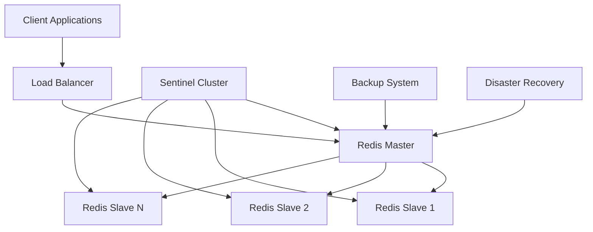
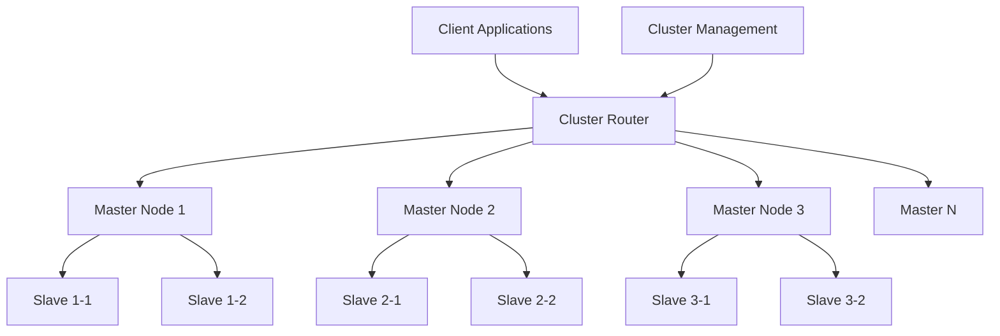
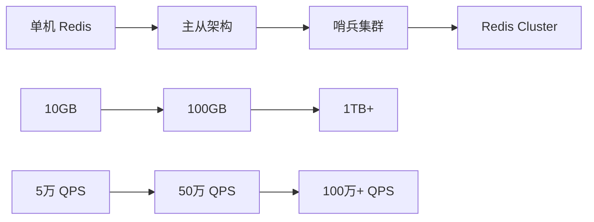

# 🏗️ Redis 企业级架构方案对比

## 📋 目录
- [第一套架构：中小规模方案](#-第一套架构中小规模方案)
- [第二套架构：大规模分布式方案](#-第二套架构大规模分布式方案)
- [架构对比与选择](#-架构对比与选择)

---

## 🎯 第一套架构：中小规模方案

### 📊 适用场景
- **数据量**: 10GB 以内
- **业务规模**: 中小型应用
- **成本考量**: 资源有限，追求性价比

### 🏛️ 架构组件



#### 🔧 核心技术栈

| 组件 | 功能 | 说明 |
|------|------|------|
| **Redis 持久化** | 数据安全保障 | RDB + AOF 混合模式 |
| **备份方案** | 数据备份策略 | 定期冷备 + 云备份 |
| **容灾方案** | 故障恢复机制 | 多级恢复策略 |
| **Replication** | 主从复制 | 读写分离架构 |
| **Sentinel** | 高可用集群 | 3节点哨兵监控 |

### 📈 性能指标

| 指标 | 性能范围 | 说明 |
|------|---------|------|
| **数据容量** | ≤ 10GB | 单 Master 可容纳 |
| **写 QPS** | 1-5 万 | Master 处理写入 |
| **读 QPS** | 10 万+ | 通过 Slave 扩展 |
| **可用性** | 99.99% | Sentinel 自动故障转移 |

### 💡 扩展策略

```bash
# 水平扩展读性能
Master (1) + Slave (N) → 读 QPS: 10万+ × N

# 扩展示例
1 Master + 3 Slaves = 支持 30万+ 读 QPS
1 Master + 10 Slaves = 支持 100万+ 读 QPS
```

---

## 🌐 第二套架构：大规模分布式方案

### 📊 适用场景
- **数据量**: 1TB+ 
- **业务规模**: 大型电商、金融系统
- **性能要求**: 海量数据 + 高并发

### 🏛️ Redis Cluster 架构



#### 🔧 核心特性

| 特性 | 说明 | 优势 |
|------|------|------|
| **多 Master 分布式存储** | 数据分片存储在不同 Master | 支持海量数据 |
| **水平扩容** | 动态添加 Master 节点 | 线性性能扩展 |
| **自动故障转移** | Slave → Master 自动切换 | 高可用性保障 |
| **数据分片** | CRC16 算法均匀分布 | 负载均衡 |

### 📈 性能指标

| 指标 | 性能范围 | 说明 |
|------|---------|------|
| **数据容量** | 1TB+ | 支持海量数据存储 |
| **读写 QPS** | 10 万+ | 集群总体性能 |
| **可用性** | 99.99% | 多重冗余保障 |
| **扩展性** | 线性扩展 | 按需添加节点 |

### ⚠️ 注意事项

> **📌 TIP**: Redis Cluster 的读写分离支持有限，需要使用 `READONLY` 命令才能从 Slave 读取。因此主要通过横向扩容 Master 来提升整体性能。

### 🛡️ 高可用方案

```bash
# 基础高可用
每个 Master + 1 Slave = 基本冗余

# 高级高可用  
每个 Master + 1 Slave + 全局 3 个冗余 Slave = 企业级高可用
```

---

## ⚖️ 架构对比与选择

### 📊 详细对比表

| 对比维度 | 第一套架构 | 第二套架构 |
|----------|-----------|-----------|
| **数据规模** | ≤ 10GB | 1TB+ |
| **节点数量** | 1 Master + N Slaves | 多 Master + 多 Slaves |
| **复杂度** | 🟢 低 | 🟡 中等 |
| **运维成本** | 🟢 低 | 🔴 高 |
| **扩展性** | 🟡 读可扩展 | 🟢 读写均可扩展 |
| **成本效益** | 🟢 高 | 🟡 中等 |
| **适用场景** | 中小型应用 | 大型企业级应用 |

### 🎯 选择指南

#### 选择第一套架构的情况：
```bash
✅ 数据量 < 10GB
✅ 读 QPS 需求 < 50万
✅ 写 QPS 需求 < 5万  
✅ 运维团队规模小
✅ 成本敏感的项目
✅ 快速部署和验证
```

#### 选择第二套架构的情况：
```bash
✅ 数据量 > 100GB
✅ 读写 QPS 需求 > 10万
✅ 需要水平扩展能力
✅ 有专业运维团队
✅ 预算充足的企业项目
✅ 长期稳定运行需求
```

---

## 🚀 性能扩展路径

### 📈 扩展路线图



### 💡 实际案例参考

#### 中型电商平台 (第一套架构)
```
数据量: 8GB
用户数: 100万+
读 QPS: 20万
写 QPS: 2万
架构: 1 Master + 5 Slaves + 3 Sentinels
可用性: 99.99%
```

#### 大型电商平台 (第二套架构)
```
数据量: 500GB  
用户数: 5000万+
读 QPS: 50万
写 QPS: 15万
架构: 6 Masters + 6 Slaves + 3 冗余 Slaves
可用性: 99.99%
```

---

## 🎯 课程实践建议

### 📚 学习路径

1. **第一阶段**: 掌握第一套架构
   - Redis 基础配置
   - 主从复制机制
   - Sentinel 高可用

2. **第二阶段**: 进阶第二套架构
   - Redis Cluster 原理
   - 分布式数据分片
   - 集群运维管理

### 🛠️ 项目实践

> **📝 实践重点**: 后续业务系统开发主要基于 **Redis Cluster** 进行，因为它具备更好的水平扩展能力和企业级的可靠性保障。

---

## 💪 最终性能保障

从架构角度，Redis 可以实现：

### 🎯 扩展能力
```
水平扩容: 机器足够 → 1TB 数据量
性能提升: 50万读写 QPS  
高可用性: 99.99% SLA 保障
```

### 🛡️ 可靠性保障
- **多重备份**: 冷备 + 热备 + 异地备份
- **自动故障转移**: Sentinel/Cluster 自动切换  
- **数据一致性**: 主从复制 + 持久化机制
- **监控告警**: 全方位性能监控

通过选择合适的架构方案，Redis 能够满足从中小型应用到大型企业级系统的各种需求。