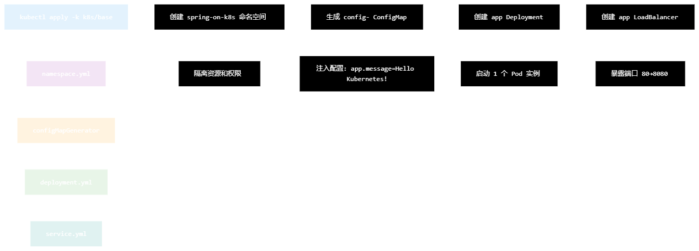

# maven package and run 
    ./mvnw clean package
    ./mvnw spring-boot:run

# build and deploy to docker
    ./mvnw spring-boot:build-image
    docker images : find the the spring-boot docker image

# deploy the k8s
    kubectl apply -k k8s/base
# 执行顺序
    namespace.yml - 创建命名空间
    configmap.yml (自动生成) - 创建配置
    deployment.yml - 部署应用 Pod
    service.yml - 创建服务和负载均衡器
 
     Namespace → ConfigMap (必须在命名空间内创建)
     ConfigMap → Deployment (Deployment 依赖 ConfigMap 挂载)
     Deployment → Service (Service 需要目标 Pod 存在)
    # 查看所有资源创建顺序
    kubectl get all -n spring-on-k8s -o wide
    
    # 查看详细创建时间
    kubectl get events -n spring-on-k8s --sort-by='.firstTimestamp'
    
    # 查看 ConfigMap 自动生成的哈希
    kubectl get configmap -n spring-on-k8s
    
    # 查看 Deployment 和 Service 的关系
    kubectl describe svc app -n spring-on-k8s

# 1. 先创建基础设施
kubectl apply -f namespace.yml
kubectl apply -k k8s/base --dry-run=client -o yaml | grep -A 10 ConfigMap

# 2. 验证配置正确
kubectl get configmap -n spring-on-k8s

# 3. 部署应用
kubectl apply -f deployment.yml
kubectl wait --for=condition=available deployment/app -n spring-on-k8s --timeout=120s

# 4. 暴露服务
kubectl apply -f service.yml

check the expose port
kubectl -n spring-on-k8s get svc