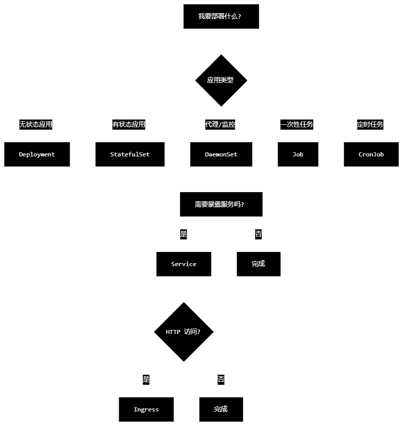

1.apiVersion 定義了 Kubernetes API 的版本，決定了資源的 schema 結構和可用功能。它告訴 Kubernetes 使用哪個 API 端點來處理該資源
    apiVersion: apps/v1          # 这是 API 组和版本
    apiVersion: v1               # 这是 API 版本
    apiVersion 表示：
    
    API 资源的功能组别
    该资源定义的版本
    与 Kubernetes 集群版本不是一一对应
2. Kubernetes 版本 ≠ API 版本
   Kubernetes 版本	支持的 API 版本
   Kubernetes 1.28	apps/v1, v1, networking.k8s.io/v1, etc.
   Kubernetes 1.25	apps/v1, v1, networking.k8s.io/v1, etc.
   Kubernetes 1.20	apps/v1, v1, networking.k8s.io/v1beta1 (部分)
   关键点：
    
    多个 Kubernetes 版本可以支持相同的 API 版本
    一个 Kubernetes 版本可能同时支持多个 API 版本
3. apiVersion 的組成結構
   apiVersion 格式為 <group>/<version> 或 <version>（核心組）：
   格式                    說明                          範例
   v1                    核心 API 組（無組名）             Pod, Service, ConfigMap
   apps/v1               apps 組                        Deployment, StatefulSet
   batch/v1              batch 組                       Job, CronJob
   networking.k8s.io/v1  networking 組                  Ingress, NetworkPolicy
4.
    # Alpha - 實驗性，可能隨時移除
    apiVersion: example.io/v1alpha1
    
    # Beta - 經過測試但可能有變更
    apiVersion: example.io/v1beta1
    
    # Stable - 穩定版本，向後兼容
    apiVersion: example.io/v1
    v1alpha1: 預設禁用，可能有 bug，不建議生產使用
    v1beta1: 經過測試，功能不會被移除但細節可能變更
    v1: 穩定，長期支援，向後兼容
5. 使用 kubectl 命令查詢：
    # Alpha - 實驗性，可能隨時移除
    apiVersion: example.io/v1alpha1
    
    # Beta - 經過測試但可能有變更
    apiVersion: example.io/v1beta1
    
    # Stable - 穩定版本，向後兼容
    apiVersion: example.io/v1

6. 根据需求确定资源类型
   首先问自己：我想做什么？
   你的需求	推荐的 Kind	API Version
   运行应用容器	Deployment	apps/v1
   运行数据库等有状态应用	StatefulSet	apps/v1
   每个节点运行代理	DaemonSet	apps/v1
   一次性任务	Job	batch/v1
   定时任务	CronJob	batch/v1
   暴露服务	Service	v1
   HTTP 路由	Ingress	networking.k8s.io/v1
   存储配置	PersistentVolumeClaim	v1
   应用配置	ConfigMap	v1
   敏感信息	Secret	v1

7. 常用组合模式
      Web 应用标准组合
    # 1. 应用部署
    apiVersion: apps/v1
    kind: Deployment
    metadata:
    name: my-app
    ---
    # 2. 服务暴露
    apiVersion: v1
    kind: Service
    metadata:
    name: my-app-service
    ---
    # 3. HTTP 路由（可选）
    apiVersion: networking.k8s.io/v1
    kind: Ingress
    metadata:
    name: my-app-ingress
8. 数据库应用组合
    # 1. 有状态部署
    apiVersion: apps/v1
    kind: StatefulSet
    metadata:
    name: my-database
    ---
    # 2. 服务暴露
    apiVersion: v1
    kind: Service
    metadata:
    name: my-database-service
    ---
    # 3. 存储声明
    apiVersion: v1
    kind: PersistentVolumeClaim
    metadata:
    name: database-storage
# 总结
   选择原则：

    需求优先：根据你要做什么选择资源类型
    稳定优先：选择稳定版本而非最新版本
    匹配原则：应用类型匹配资源类型
    组合使用：多个资源协同工作
    记住这个顺序：确定需求 → 选择 Kind → 确认 API Version → 编写配置

方法一：使用 kubectl 查詢
    kubectl api-resources | grep -i deployment
方法二：查看資源說明
    kubectl explain deployment
方法三：常用對照表
    # 工作負載 → apps/v1
    apiVersion: apps/v1
    kind: Deployment / StatefulSet / DaemonSet / ReplicaSet
    
    # 核心資源 → v1
    apiVersion: v1
    kind: Pod / Service / ConfigMap / Secret / Namespace
    
    # 批次任務 → batch/v1
    apiVersion: batch/v1
    kind: Job / CronJob
    
    # 網路 → networking.k8s.io/v1
    apiVersion: networking.k8s.io/v1
    kind: Ingress / NetworkPolicy
    
    # RBAC → rbac.authorization.k8s.io/v1
    apiVersion: rbac.authorization.k8s.io/v1
    kind: Role / ClusterRole / RoleBinding
快速決策流
    需要部署應用嗎？
    ├─ 是 → 應用有狀態嗎？
    │        ├─ 是 → StatefulSet
    │        └─ 否 → Deployment ✅
    └─ 否 → 需要什麼功能？
    ├─ 暴露端點 → Service
    ├─ 配置 → ConfigMap/Secret
    └─ HTTP 路由 → Ingress
